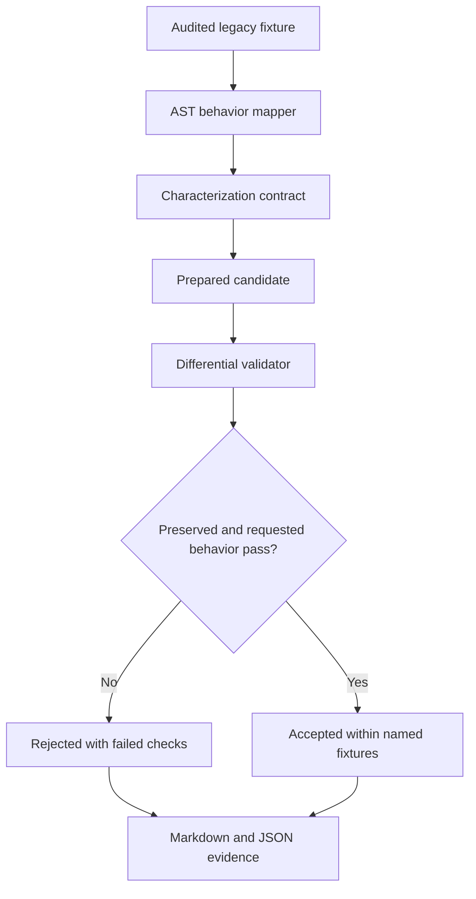

# ShadowSpec

**Reject the broad patch. Accept the narrow one. Export the proof.**

ShadowSpec is a zero-key evidence workbench for one risky maintenance job: changing undocumented legacy behavior without quietly changing something else.

The bundled demo asks for one precise change to a Python order service: accept surrounding whitespace in `SAVE10` while preserving case sensitivity, pricing, errors, and the SQLite audit write.

## Problem

Legacy maintenance fails when a patch satisfies the new request but silently changes an old contract. Reviewers need executable evidence of both the intended delta and the behavior that must remain unchanged.

## Three-minute golden path

1. Run **Plausible bad candidate**. It trims and uppercases the code, so the new example passes but lowercase behavior changes. ShadowSpec rejects it.
2. Run **Narrow candidate**. It trims surrounding whitespace only. Characterization and acceptance checks pass.
3. Download the Markdown or JSON evidence pack containing the real diff, provenance hashes, named checks, risks, reviewer checklist, and rollback notes.

## Expected proof

| Candidate | Characterization | New acceptance check | Verdict |
| --- | --- | --- | --- |
| Baseline | Pass | Fail | Rejected: request not implemented |
| Bad: `strip().upper()` | Fail | Pass | Rejected: lowercase behavior changed |
| Narrow: `strip()` | Pass | Pass | Accepted for the named fixtures |

ShadowSpec never treats “the new example works” as sufficient evidence. Existing observations and the requested delta are tested separately.

## Setup

Requires Python 3.12 or later.

```bash
python -m venv .venv
source .venv/bin/activate  # Windows: .venv\Scripts\activate
pip install -r requirements-dev.txt
pytest -q
streamlit run app.py
```

The `app.py` entry point adds the repository's `src/` directory before importing
the application package, so this launch works after a dependencies-only install
without setting `PYTHONPATH`. Keep the bundled `fixtures/legacy_orders` directory
alongside `app.py` in deployments.

CLI proof:

```bash
PYTHONPATH=src python -m shadowspec.cli run bad --format markdown
PYTHONPATH=src python -m shadowspec.cli run narrow --format json
```

## Architecture



The analyzer never imports repository code. It inventories Python files, functions, static calls, syntax failures, and side-effect signals. The validator only executes three server-owned audited variants in per-run temporary directories with a timeout, bounded output, and an empty explicit environment.

These controls are not an OS-level sandbox. The hosted demo does not execute arbitrary uploaded or fetched repositories.

## Why IBM Bob is central

ShadowSpec includes repository guidance for five Bob roles:

1. Mapper
2. Characterization-test designer
3. Implementer
4. Critic/security reviewer
5. Release reviewer

Bob's full-repository context connects behavior mapping, characterization-test design, implementation, criticism, and release review instead of treating each file as an isolated prompt. The actor-critic handoff makes the patch falsifiable before release. See [AGENTS.md](AGENTS.md), [Bob workflow](docs/architecture/bob-workflow.md), and the role contracts under [`bob/`](bob/).

The Markdown role files are conservative workflow artifacts. They do not claim a specific Bob runtime syntax. When the project is run in IBM Bob, exported and redacted session evidence belongs in [`bob_sessions/`](bob_sessions/). The public zero-key demo performs deterministic local analysis and does not impersonate live Bob inference.

## Evidence pack

Each run exports:

- changed files and source SHA-256
- intended behavior delta
- named preserved behavior
- static analysis and limitations
- failed checks and raw normalized summary
- reviewer checklist
- risks and rollback notes

## Security boundary

- Bundled fixture execution only
- No arbitrary uploads, dependency installation, or fetched-code execution
- Candidate allowlist checked before file access
- Repository paths constrained beneath a fixed root, including symlink checks
- Per-run temporary directory, three-second timeout, bounded output
- No secrets passed explicitly to the validation subprocess
- No autonomous merge or deployment

See [security.md](docs/submission/security.md) for the threat boundary and limitations.

## Tests

```bash
pytest -q --cov=shadowspec --cov-report=term --cov-fail-under=85
```

Verified release baseline: **43 tests passed, 92.12% coverage**. CI enforces at least 85% coverage.

## Demo and submission

- Live demo: `PUBLIC_URL_PENDING`
- GitHub repository: `GITHUB_URL_PENDING`
- Demo video: `VIDEO_URL_PENDING`

## Submission materials

- [Under-three-minute demo script](docs/submission/demo-script.md)
- [Judge pitch](docs/submission/judge-pitch.md)
- [Submission copy](docs/submission/submission-copy.md)
- [Decision log](docs/submission/decision-log.md)
- [Deployment guide](docs/submission/deployment.md)
- [Winner-pattern research](docs/research/winner-pattern-report.md)

## Scope limits

An accepted result means that the named observations passed for the audited fixture, together with the requested acceptance check. It does not prove semantic equivalence, complete dynamic-call coverage, or production safety for an arbitrary codebase.

## License

[MIT](LICENSE) © 2026 Sutharshan Kanthakumar. Dependency licenses are unchanged.
