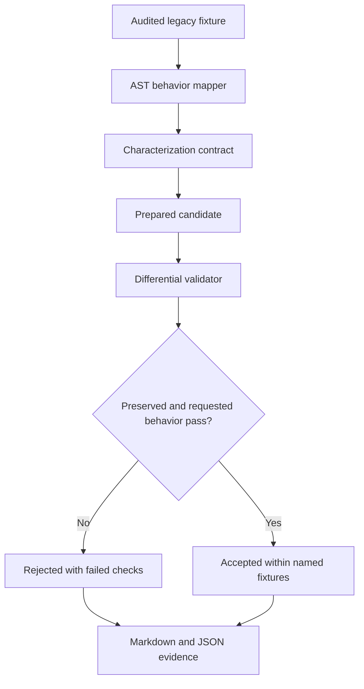

# ShadowSpec

> **Hackathon build (IBM Bob 2.0, lablab.ai):** authored by IBM Bob on branch [`bob-2.0-build-2026-09-25`](https://github.com/muffedd/ShadowSpec/tree/bob-2.0-build-2026-09-25) starting after kickoff on 2026-09-25. See [event-window provenance](docs/release/event-window-provenance.md).

**Reject the broad patch. Accept the narrow one. Export the proof.**

ShadowSpec is a zero-key evidence workbench for one risky maintenance job: changing undocumented legacy behavior without quietly changing something else.

## Problem and business value

Legacy maintenance fails when a patch satisfies the new request but silently changes an old contract. That failure mode is expensive: it ships as a regression discovered by customers, not reviewers, and the audit trail is a shrug. ShadowSpec turns review into executable evidence — the intended delta and the behavior that must remain unchanged are tested separately, and the verdict ships with a proof pack a reviewer can check in minutes instead of hours.

The bundled demo asks for one precise change to a Python order service: accept surrounding whitespace in `SAVE10` while preserving case sensitivity, pricing, errors, and the SQLite audit write.

## Live demo

- **Live demo:** https://shadowspec-demo.pages.dev
- **Source:** https://github.com/muffedd/ShadowSpec

### Try it in 60 seconds

1. Open the live demo and run **Plausible bad candidate**. Verdict: REJECTED - the new whitespace case passes, but lowercase `save10` behavior changed.
2. Run **Narrow candidate**. Verdict: ACCEPTED - preserved behavior and the requested delta both pass.
3. Open the evidence drawer to see the diff, provenance hashes, and export a condensed preview.

| Build proof | |
| --- | --- |
| Tests | 76 passed, 3 platform-gated skips |
| Coverage | 91.46% (CI enforces >= 85%) |
| IBM Bob sessions | 6 exported task transcripts + consumption screenshots in [`bob_sessions/`](https://github.com/muffedd/ShadowSpec/tree/bob-2.0-build-2026-09-25/bob_sessions) |

## CI behavior gate

The event branch ships a GitHub Actions [behavior-gate workflow](https://github.com/muffedd/ShadowSpec/blob/bob-2.0-build-2026-09-25/.github/workflows/behavior-gate.yml) plus [`scripts/check-behavior-gate.sh`](https://github.com/muffedd/ShadowSpec/blob/bob-2.0-build-2026-09-25/scripts/check-behavior-gate.sh): a deliberately bad candidate PR goes red (rejected), while the accepted narrow candidate stays green. The workflow reports the PR's actual changed files and runs the differential check against them; merge blocking itself comes from branch protection requiring the green check. What is and is not proven is scoped explicitly in [docs/branch-protection.md](https://github.com/muffedd/ShadowSpec/blob/bob-2.0-build-2026-09-25/docs/branch-protection.md).

## Three-minute golden path

1. Run **Plausible bad candidate**. It trims and uppercases the code, so the new example passes but lowercase behavior changes. ShadowSpec rejects it.
2. Run **Narrow candidate**. It trims surrounding whitespace only. Characterization and acceptance checks pass.
3. Download the Markdown or JSON evidence pack containing the real diff, provenance hashes, named checks, risks, reviewer checklist, and rollback notes.

## Expected proof

| Candidate | Characterization | New acceptance check | Verdict |
| --- | --- | --- | --- |
| Baseline | Pass | Fail | Rejected: request not implemented |
| Bad: `strip().upper()` | Fail | Pass | Rejected: lowercase behavior changed |
| Narrow: `strip()` | Pass | Pass | Accepted for the named fixtures |

ShadowSpec never treats "the new example works" as sufficient evidence. Existing observations and the requested delta are tested separately.

## Setup

Requires Python 3.12 or later for the pinned install. The engine itself is standard-library only: to run just the core test suite, `pip install pytest pytest-cov` is enough (`tests/test_app.py` needs Streamlit and `tests/test_deployment.py` needs Python 3.11+; both are platform-gated).

```bash
python -m venv .venv
source .venv/bin/activate  # Windows: .venv\Scripts\activate
pip install -r requirements-dev.txt
pytest -q
streamlit run app.py
```

`requirements.in` and `requirements-dev.in` are the small direct-dependency
inputs. The corresponding `.txt` files pin the complete Python 3.12 dependency
graphs consumed by deployment and CI.

The `app.py` entry point adds the repository's `src/` directory before importing
the application package, so this launch works after a dependencies-only install
without setting `PYTHONPATH`. Keep the bundled `fixtures/legacy_orders` directory
alongside `app.py` in deployments.

The CLI is intentionally a source-checkout command because it consumes the
repository-level audited fixture. The distribution does not install a
`shadowspec` console script.

```bash
PYTHONPATH=src python -m shadowspec.cli run bad --format markdown
PYTHONPATH=src python -m shadowspec.cli run narrow --format json
```

## Architecture



The analyzer never imports repository code. It inventories Python files, functions, static calls, syntax failures, and side-effect signals. The validator only executes three server-owned audited variants in per-run temporary directories with a timeout, bounded output, and an empty explicit environment.

These controls are not an OS-level sandbox. The hosted demo does not execute arbitrary uploaded or fetched repositories.

## Workflow guidance for IBM Bob

ShadowSpec includes repository guidance for five Bob roles:

1. Mapper
2. Characterization-test designer
3. Implementer
4. Critic/security reviewer
5. Release reviewer

The checked-in Markdown files propose a full-repository, actor-critic handoff for
use in an IBM Bob IDE. They are workflow guidance, not evidence that Bob performed
this build. See [AGENTS.md](AGENTS.md), [Bob workflow](docs/architecture/bob-workflow.md),
and the role contracts under [`bob/`](bob/).

The six Bob session exports from the `bob-2.0-build-2026-09-25` build — task transcripts plus consumption screenshots — are in [`bob_sessions/`](https://github.com/muffedd/ShadowSpec/tree/bob-2.0-build-2026-09-25/bob_sessions) on the event branch. These are redacted task-history exports from the IBM Bob IDE sessions that authored that branch. The public zero-key demo performs deterministic local analysis and does not impersonate live Bob inference.

## Evidence pack

Each run exports:

- changed files and source SHA-256
- intended behavior delta
- named preserved behavior
- static analysis and limitations
- failed checks and raw normalized summary
- reviewer checklist
- risks and rollback notes

## Security boundary

- Bundled fixture execution only
- No arbitrary uploads, dependency installation, or fetched-code execution
- Candidate allowlist checked before file access
- Immutable server-owned SHA-256 manifest checked for the baseline and selected
  candidate before subprocess launch; these audited hashes are the
  verdict-integrity boundary
- Repository paths constrained beneath a fixed root, including symlink checks
- Per-run temporary directory, three-second timeout, bounded output
- No secrets passed explicitly to the validation subprocess
- These application controls are not an OS-level sandbox
- No autonomous merge or deployment

See [security.md](docs/submission/security.md) for the threat boundary and limitations.

## Tests

```bash
pytest -q --cov=shadowspec --cov-report=term --cov-fail-under=85
```

Verified reference baseline: **76 tests passed, 3 platform-gated skips, 91.46% coverage**. CI enforces at least 85% coverage.

## Demo and submission

- Live demo: https://shadowspec-demo.pages.dev
- GitHub repository: https://github.com/muffedd/ShadowSpec
- Demo video: `VIDEO_URL_PENDING`

## Submission materials

- [Hackathon slide deck](assets/submission/ShadowSpec-Hackathon-Deck.pptx)
- [One-page project brief](assets/submission/ShadowSpec-One-Page.pdf)
- [Under-three-minute demo script](docs/submission/demo-script.md)
- [Judge pitch](docs/submission/judge-pitch.md)
- [Submission copy](docs/submission/submission-copy.md)
- [Decision log](docs/submission/decision-log.md)
- [Deployment guide](docs/submission/deployment.md)
- [Winner-pattern research](docs/research/winner-pattern-report.md)

## Scope limits

An accepted result means that the named observations passed for the audited fixture, together with the requested acceptance check. It does not prove semantic equivalence, complete dynamic-call coverage, or production safety for an arbitrary codebase. Verdicts apply to the bundled named fixtures only.

## License

[MIT](LICENSE) © 2026 Sutharshan Kanthakumar. Dependency licenses are unchanged.
