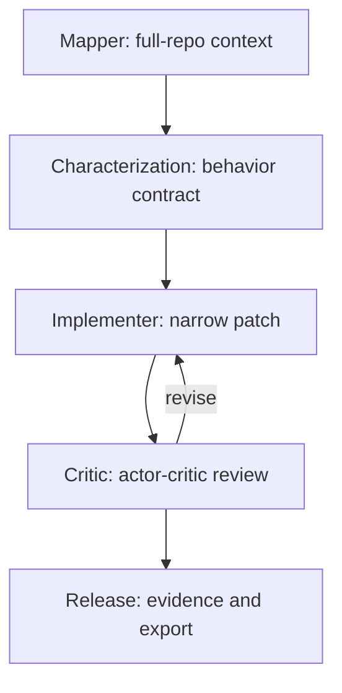
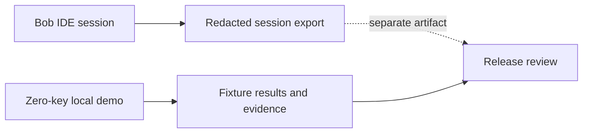

# IBM Bob workflow architecture

ShadowSpec uses IBM Bob as a structured development workflow around one
audited legacy fixture. The checked-in files are role guidance and evidence
templates in conservative Markdown. They do not assert that this repository
contains IBM Bob runtime support or that the prose is an officially
executable mode/skill format; use the syntax supported by the actual Bob IDE
integration when starting a real session.

## Five roles and handoffs

The mapper identifies the requested delta, callers, side effects, tests,
security boundaries, and unknowns. The characterization role freezes named
observations and keeps the new acceptance check separate. The implementer
changes the smallest appropriate surface. The critic independently tries to
falsify both the patch and its safety claims. The release reviewer assembles a
bounded verdict and redacted export.

The critic receives the mapper and characterization packets plus the complete
diff; it does not receive only the implementer’s success summary. This is the
actor-critic boundary that makes an over-broad candidate useful evidence: the
bad candidate should fail a preserved behavior, while the narrow candidate
should pass the acceptance scenario and retain the baseline observations.

## Full-repository context packet

Every role starts from `AGENTS.md`, the design, implementation plan, package
metadata, repository status/diff, relevant source, fixture variants, tests,
and existing evidence. A packet records the revision/source hash (when
available), inspected paths, requested delta, explicit non-goals, observed
behavior, static-analysis limitations, security boundaries, and open
questions. Handoffs refresh the packet after a patch so no role relies on stale
context.

The workflow is intentionally scoped. A passing named fixture is not semantic
equivalence for an arbitrary repository, and static blast-radius analysis is
not complete around dynamic dispatch.

## Zero-key demo versus Bob session

The public demo runs deterministic local analysis and validation of the
bundled fixture. It needs no API key and must not claim that it called Bob or
another model. A real Bob IDE session may help author or review the patch, but
its transcript is optional development evidence and remains separate from the
demo’s execution path.

## Security boundaries

Hosted execution is restricted to the bundled fixture. Public GitHub sources,
if exposed, are validated and analysis-only; uploaded or fetched code is not
imported, installed, or executed. Paths are canonicalized beneath a fixed
root. Validation subprocesses use temporary workspaces, bounded output, and a
timeout. Secrets are not passed explicitly and must not appear in evidence or
session exports. These controls are application guardrails, not an OS-level
sandbox claim.

The critic checks these boundaries independently, and the release role blocks
the evidence package when a boundary is unclear.

## Session export

For actual IBM Bob use, export the session only after the release checklist.
Follow `bob_sessions/README.md` for the filename, metadata, handoff summary,
verdict, and redaction requirements. If a Bob integration uses a different
export mechanism, preserve the same information in a Markdown manifest rather
than assuming that these role files can be replayed.

